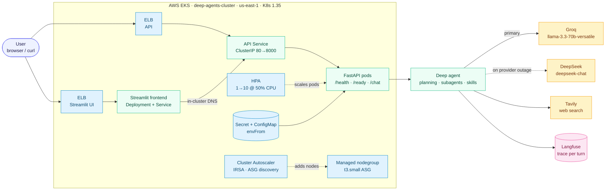
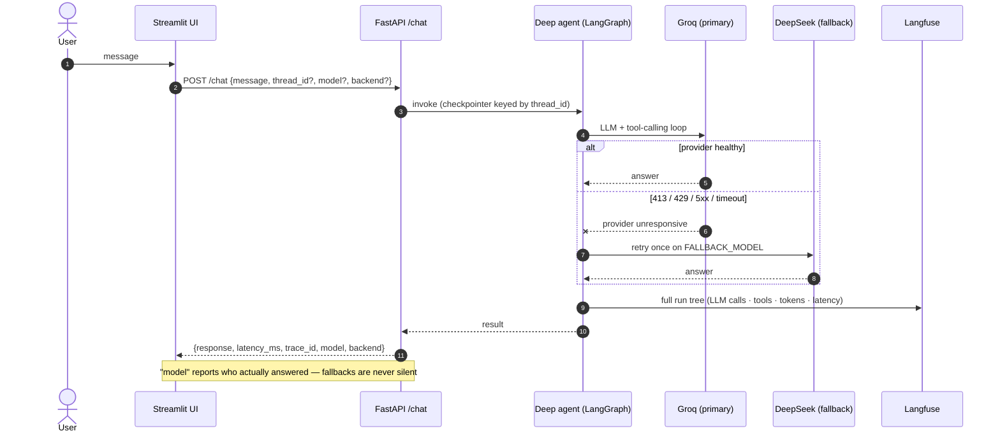
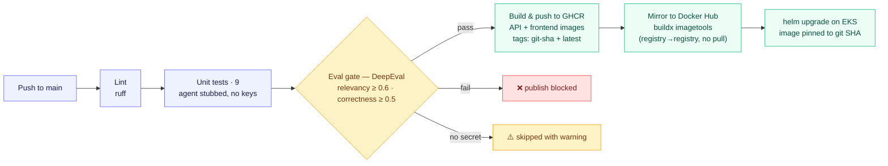

# LLMOps Deep Agent — FastAPI · LangGraph · Kubernetes · AWS EKS

A production-style **LLMOps pipeline** around a planning **deep agent** (subagents + skills + persistent memory, built on [`deepagents`](https://github.com/langchain-ai/deepagents) / LangGraph): served with FastAPI, traced end-to-end in Langfuse, quality-gated in CI by an LLM-as-judge, shipped through GitHub Actions to two registries, and **running live on AWS EKS** with autoscaling at both the pod and the node layer — including an automatic cross-provider fallback that has **survived two real provider outages in production**.

<p align="left">
  <a href="https://github.com/Amith-Ganta/llmops-deep-agent/actions/workflows/ci.yml"></a>
  
  
  
  
  
  
  
  
  
</p>

---

## 🔗 Live demo

| Surface | URL |
|---------|-----|
| 💬 **Chat UI (Streamlit)** | http://ac92bf82396074d1c9eea748febd1e3e-2038085742.us-east-1.elb.amazonaws.com |
| ⚡ **API (Swagger)** | http://a2e22fecbf11e4e7cafc556a913d4b32-1236537386.us-east-1.elb.amazonaws.com/docs |

```bash
curl -X POST http://a2e22fecbf11e4e7cafc556a913d4b32-1236537386.us-east-1.elb.amazonaws.com/chat \
  -H "Content-Type: application/json" -d '{"message":"What is RAG?"}'
```

> Runs on Groq's free tier (100k tokens/day ≈ 9–12 agent turns). When the daily budget is spent, the **DeepSeek fallback answers automatically** — try it late in the day and check the `"model"` field in the response.

---

## 🎯 What this project demonstrates

This is not a notebook that calls an LLM — it is the **whole operational lifecycle** of an agentic service:

| Competency | Where to look |
|------------|---------------|
| **Agentic system design** | Planning tool, research subagent on a cheaper model, skills with progressive disclosure, three pluggable memory backends — [core/](core/) |
| **API & service design** | Typed request/response models, per-thread conversations, liveness/readiness split by meaning — [app/](app/) |
| **Resilience engineering** | Cross-provider fallback with an outage classifier — reroutes on 413/429/5xx/timeout, never on our own bad requests — [app/agent_runtime.py](app/agent_runtime.py) |
| **LLM observability** | Langfuse trace per turn: full LangGraph run tree, token counts, latency, sessions grouped by `thread_id` — [app/observability.py](app/observability.py) |
| **LLM evaluation in CI** | DeepEval golden-dataset gate (relevancy + correctness) that **blocks the Docker publish** on failure — [evals/](evals/) |
| **CI/CD discipline** | Lint → unit tests (agent stubbed, zero keys) → eval gate → build → publish to GHCR, mirror to Docker Hub — [.github/workflows/ci.yml](.github/workflows/ci.yml) |
| **Kubernetes operations** | Helm chart, HPA (load-tested 1→6), Cluster Autoscaler with IRSA, VPA/Goldilocks right-sizing evidence — [helm/deep-agent/](helm/deep-agent/) |
| **Cloud deployment** | Live on EKS behind public LoadBalancers; UI and API as decoupled Deployments talking over cluster DNS |
| **Cost-aware engineering** | Model selection driven by rate-limit math; free-tier budgets treated as an SLO constraint, not an afterthought |

---

## 📊 Verified in production

Numbers measured on the live EKS deployment, not projected:

| Metric | Value |
|--------|-------|
| End-to-end chat latency (public UI → EKS → Groq → back) | **1,031 ms** |
| Docker image (non-root, uid 1000) | **398 MB** |
| HPA under synthetic load | scaled **1 → 6 replicas** (max 10 @ 50 % CPU) |
| Cross-provider fallback | survived **2 real Groq outages** (413 TPM, 429 TPD) with zero user-facing errors |
| Unit tests (agent stubbed — fast, free, key-less) | **9**, run on every push |
| Eval gate thresholds | AnswerRelevancy ≥ 0.6 · GEval Correctness ≥ 0.5 |
| Actual pod usage vs request (Goldilocks/VPA evidence) | ~15m CPU / ~121Mi vs 200m / 256Mi — deliberate headroom |

---

## 🏗️ Architecture

### System overview



### Request lifecycle — including the fallback path



### CI/CD pipeline



---

## 🧠 Design decisions & trade-offs

The choices interviewers ask "why" about — each one deliberate:

| Decision | Why | Trade-off accepted |
|----------|-----|--------------------|
| **Immutable image tags** — deploy `:<git-sha>` with `IfNotPresent`, never `latest` + `Always` | Rollbacks are exact; "what is running?" has exactly one answer. Built once in CI, mirrored GHCR → Docker Hub with `buildx imagetools` (registry-to-registry). | Every deploy is an explicit chart edit — no "just repull". That's a feature. |
| **Fallback on a *different provider* (DeepSeek)** | A Groq-wide outage or exhausted Groq quota cannot take the fallback down with it. Classifier reroutes only on provider-outage signatures (413/429/5xx/timeout) — never on our own bad requests. | One retry adds latency on outage; a second provider key to manage. |
| **Model policy from rate-limit math** | The agent's prompt is ~8.2k tokens; the primary's TPM cap must exceed it. `llama-3.3-70b` (12k TPM) works; `gpt-oss-120b` (8k TPM) can never serve a single call. | Free-tier 100k TPD ≈ 9–12 turns/day — then the fallback takes over by design. |
| **All config in the chart, secrets via `envFrom`** | `values.yaml` `config:` map renders env vars via a template loop; new secret keys reach pods with zero template edits. Nothing is ever `kubectl set env`-ed — `helm upgrade` reconciles everything. | Config changes ship as chart releases, not hot edits. Single source of truth. |
| **Autoscaling at both layers** | HPA (1→10 @ 50 % CPU, load-tested 1→6) owns pod count; Cluster Autoscaler (IRSA via OIDC + scoped IAM, ASG auto-discovery) adds nodes when pods go Pending. | Two controllers to reason about — so their responsibilities never overlap. |
| **VPA in recommend-only mode (Goldilocks)** | Evidence-based right-sizing: actual ~15m CPU/121Mi vs requested 200m/256Mi. HPA owns replica count, so the VPA updater stays **off** — the two fight over the same signal otherwise. | Requests keep deliberate headroom instead of being auto-shrunk. |
| **Probes split by meaning** | Liveness `/health` never touches the LLM — a provider outage must not restart healthy pods. Readiness `/ready` gates on the agent graph being built. | A pod can be alive-but-not-ready during provider trouble; that is correct behavior. |
| **UI decoupled from API** | Streamlit is its own Deployment + Service reaching the API via cluster DNS; distinct `app.kubernetes.io/name` label so the API Service selector can never match UI pods. UI holds zero secrets. | Two Deployments to operate — and independent scaling/rollout for each. |
| **Unit tests stub the agent** | 9 tests run on every push with no API keys — fast, free, deterministic. Only the eval gate spends tokens. | Integration behavior is covered by the eval gate, not unit tests. |

---

## 📡 API reference

| Method | Endpoint | Purpose |
|--------|----------|---------|
| `GET` | `/health` | Liveness — process is up; **never touches the LLM** |
| `GET` | `/ready` | Readiness — agent graph built successfully |
| `GET` | `/info` | Running config + pickable `available_models` / `available_backends` |
| `POST` | `/chat` | One agent turn → `{response, thread_id, latency_ms, trace_id, model, backend}` |
| `GET` | `/docs` | OpenAPI UI |

Same `thread_id` = same conversation (LangGraph checkpointer). The returned `trace_id` links the turn to its Langfuse trace.

`model` and `backend` are optional per-request overrides, validated against `/info`. Groq's free-tier limits are **per model**, so switching models mid-day is a real workaround, not a preference. Setting `OPENAI_API_KEY` / `DEEPSEEK_API_KEY` automatically unlocks those providers' models in the picker — models whose key is missing are never offered.

`backend` selects one of three deepagents memory types:

| Backend | Agent files live in… | Survives restart | Shared across threads |
|---------|---------------------|------------------|----------------------|
| `StateBackend` | the conversation state | ❌ | ❌ |
| `FilesystemBackend` | real files under `workspace/` | ✅ | ✅ |
| `StoreBackend` | a LangGraph store (AGENTS.md pre-seeded) | ❌ | ✅ |

Each `(model, backend)` combo gets its own agent instance and checkpointer, so conversation history is kept per combo.

---

## 🕵️ The agent

A research-style deep agent with:

- **Planning** — a todo-list tool the agent uses to decompose tasks
- **Subagents** — a `research-agent` running on a cheaper model (`llama-3.1-8b-instant`) for parallel research
- **Skills** ([skills/](skills/)) — progressive-disclosure instructions for AWS, LangGraph, Python, report writing
- **Persistent memory** ([config/AGENTS.md](config/AGENTS.md)) and **Tavily** web search
- **Virtual file system** — `StateBackend` / `FilesystemBackend` / `StoreBackend`, selectable per request

### The fallback, battle-tested

Both provider failure modes have been observed **live in production**:

1. **413 TPM** — the agent's prompt (system prompt + tool schemas) is ~8.2k tokens; on a model with an 8k tokens-per-minute cap every call is rejected before it starts.
2. **429 TPD** — the daily 100k-token budget ran out mid-day; DeepSeek served traffic until the rolling window recovered.

In both cases the pod logged `Primary model ... unresponsive ... falling back to deepseek:deepseek-chat` and the user got an answer instead of an error. The response's `"model"` field always reports who actually answered — fallbacks are visible to clients and in Langfuse.

---

## ✅ Evaluation gate (DeepEval)

[evals/](evals/) runs the **real agent in-process** against a golden dataset and judges every answer:

| Metric | Threshold | What it checks |
|--------|-----------|----------------|
| `AnswerRelevancyMetric` | 0.6 | Did the answer actually address the question? |
| `GEval` "Correctness" | 0.5 | Does it contain the expected facts (per-case criteria)? |

The judge is a custom `DeepEvalBaseLLM` wrapper ([evals/judge.py](evals/judge.py)) that auto-selects the best provider from available keys — **DeepSeek > OpenAI > Groq** (override with `EVAL_JUDGE=provider:model`). Evals run with web search and subagents disabled, so scores measure the model + prompt, not Tavily.

In CI the gate runs after unit tests and **blocks the Docker publish** on failure. If the `GROQ_API_KEY` secret is absent, the gate skips with a visible warning instead of failing the build — forks and demos stay green.

> LLM-judged scores are probabilistic evidence, not proof — every metric runs with `include_reason=True`, so failures explain themselves in the CI log.

---

## 🔭 Observability (Langfuse)

[app/observability.py](app/observability.py) attaches the Langfuse v3 `CallbackHandler` to every agent invocation when `LANGFUSE_*` keys are present — and is a clean no-op when they're absent. Each `/chat` turn becomes a trace with the full LangGraph run tree (model calls, tool calls, token counts, latency), tagged with `thread_id` as the session id so multi-turn conversations group together in the Langfuse UI.

---

## 🛠️ Run it locally

```bash
cp .env.example .env        # GROQ_API_KEY required; Tavily / Langfuse / DeepSeek keys optional

make install
make run                    # uvicorn on :8000
make frontend               # Streamlit chat UI on :8501
make evals                  # DeepEval gate locally
```

Or straight from Docker Hub:

```bash
docker run -p 8000:8000 -e GROQ_API_KEY=your_key amith98480/llmops-deep-agent:latest
```

The Streamlit sidebar shows live `/health` / `/ready` / `/info` state, plus **🧠 Model** and **💾 Memory** dropdowns (populated from `/info`) to switch the LLM and memory backend per conversation. Every answer displays its latency, the model/backend that produced it, and its Langfuse trace ID.

---

## 🚢 Deployment — three progressive rungs

Same image, same chart, at every step.

### 1 — Docker

```bash
make docker-build && make docker-run     # :8000, reads .env
```

### 2 — Kubernetes locally (kind + Helm)

```bash
make kind-up                # cluster + metrics-server
make kind-load              # load the local image
make deploy                 # secret from .env + helm upgrade --install
kubectl port-forward svc/deep-agent 8080:80
```

[helm/deep-agent](helm/deep-agent/) deploys a non-root Deployment (env from ConfigMap + Secret, liveness `/health`, readiness `/ready`), a ClusterIP Service, and an `autoscaling/v2` HPA (1→3 @ 70 % CPU locally).

### 3 — AWS EKS (production, live now)

The same chart with production overrides: LoadBalancer Services (classic ELBs), HPA 1→10 @ 50 %, image pinned to a git SHA, Cluster Autoscaler with IRSA, and the Streamlit frontend as its own Deployment + Service built from [frontend/Dockerfile](frontend/Dockerfile).

```bash
kubectl create secret generic deep-agent-secrets --from-env-file=.env
helm upgrade --install deep-agent helm/deep-agent
```

---

## ⚙️ Configuration

All knobs are env vars (12-factor), defaults in [app/settings.py](app/settings.py):

| Variable | Default | Meaning |
|----------|---------|---------|
| `GROQ_API_KEY` | — | **required** — agent + fallback eval judge |
| `OPENAI_API_KEY` / `DEEPSEEK_API_KEY` | — | optional — unlock those providers in the model picker and as eval judge |
| `EVAL_JUDGE` | auto by key | force the eval judge, e.g. `openai:gpt-4o` |
| `TAVILY_API_KEY` | — | web search (agent degrades gracefully without it) |
| `LANGFUSE_SECRET_KEY` / `LANGFUSE_PUBLIC_KEY` / `LANGFUSE_BASE_URL` | — | tracing (off if unset) |
| `DEEPAGENT_MODEL` | `groq:llama-3.3-70b-versatile` | main agent model |
| `SUBAGENT_MODEL` | `groq:llama-3.1-8b-instant` | research subagent model |
| `FALLBACK_MODEL` | `deepseek:deepseek-chat` if key set, else off | one retry here when the primary provider is unresponsive |
| `DEEPAGENT_BACKEND` | `StateBackend` | default memory: `StateBackend` \| `FilesystemBackend` \| `StoreBackend` |
| `AVAILABLE_MODELS` | 6 Groq models + key-gated OpenAI/DeepSeek | whitelist clients may pick from per request |
| `ENABLE_WEB_SEARCH` / `ENABLE_SUBAGENTS` | `true` | feature flags |
| `EAGER_INIT` | `true` | build the agent at startup (readiness gate) |
| `SYSTEM_PROMPT` | research assistant | override the agent's instructions |
| `RECURSION_LIMIT` | `50` | LangGraph step budget per turn |

---

## 🗺️ Production-readiness roadmap

- [x] FastAPI service — health/readiness probes, per-thread conversations
- [x] Langfuse tracing on every agent turn
- [x] DeepEval quality gate blocking the Docker publish in CI
- [x] Docker (non-root) → GHCR + Docker Hub, immutable SHA tags
- [x] Helm chart with HPA — kind locally, EKS in production
- [x] EKS: managed node group, IRSA, Cluster Autoscaler, load-tested HPA (1→6)
- [x] Cross-provider fallback — verified live, twice
- [x] Public Streamlit UI as a decoupled Deployment + Service
- [ ] Terraform for cluster + registry (currently eksctl/CLI-provisioned)
- [ ] ALB Ingress + TLS (consolidate the two classic ELBs)
- [ ] Prometheus `/metrics` + Grafana dashboard
- [ ] Streaming responses (SSE) from the agent graph

---

## 📂 Project structure

```
app/        FastAPI service — routes, settings, Langfuse wiring, agent runtime + fallback
core/       the deep agent — graph builder, memory backends, tools
frontend/   Streamlit chat UI — pure HTTP client of the API, zero secrets
config/     AGENTS.md — persistent agent memory
skills/     agent skills (progressive disclosure)
tests/      unit tests — agent stubbed, no keys needed
evals/      DeepEval golden-dataset gate — real agent + key-selected LLM judge
helm/       Helm chart — Deployment / Service / ConfigMap / HPA (+ frontend)
k8s/        kind cluster config
```

---

## 🩹 Troubleshooting

| Symptom | Cause | Fix |
|---------|-------|-----|
| `413` from Groq on every call | Model's TPM cap < the agent's ~8.2k-token prompt | Pick a primary whose TPM cap exceeds the prompt (`llama-3.3-70b`: 12k) |
| `429` from Groq mid-day | 100k tokens/day spent (~9–12 turns; an eval run costs ~40–50k) | Wait for the window, switch `model` per request, or let the DeepSeek fallback serve |
| HPA shows `<unknown>` CPU | metrics-server missing | On kind: install it with `--kubelet-insecure-tls` |
| `/ready` returns 503 | Agent graph failed to build (usually a bad/missing `GROQ_API_KEY`) | Check pod logs and the secret. `/health` staying 200 is correct — liveness never touches the LLM |
| Eval gate skipped in CI | `GROQ_API_KEY` secret not configured | Add the secret; the skip is deliberate (visible warning, not a red build) |
| UI shows "API offline" | Sidebar API URL points at the wrong host/port | `:8000` local/Docker, `:8080` through the kind port-forward |
| `/` returns 404 on the API | By design — no root route | Use `/docs`, `/health`, `/ready`, `/chat` |

---

## 👨‍💻 More of my work

| Project | What it shows |
|---------|---------------|
| [Rag-fullstack-docker-AWS](https://github.com/Amith-Ganta/Rag-fullstack-docker-AWS) | Full-stack RAG service — FastAPI + Chroma + Streamlit, CI/CD to EC2 |
| [FastAPI-ML-Docker-AWS](https://github.com/Amith-Ganta/FastAPI-ML-Docker-AWS) | Classical-ML model served with FastAPI, containerized and deployed to AWS |
| [MCP-Multi-Server](https://github.com/Amith-Ganta/MCP-Multi-Server) | Multi-server Model Context Protocol tooling |

---

## 📝 License

MIT — see [LICENSE](LICENSE).
