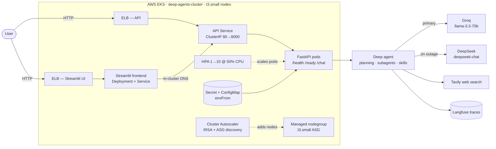
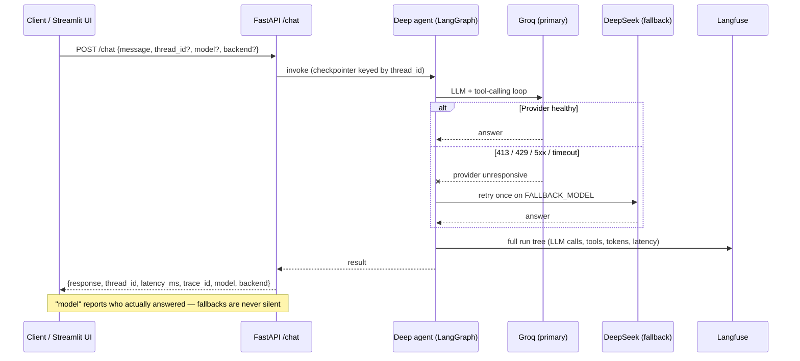
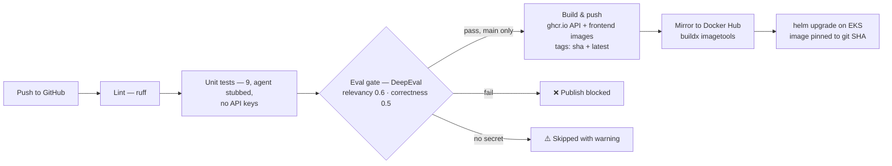

# 🤖 LLMOps Deep Agent — FastAPI · LangGraph · Docker · EKS

[](https://github.com/Amith-Ganta/llmops-deep-agent/actions/workflows/ci.yml)
[](https://hub.docker.com/r/amith98480/llmops-deep-agent)
[](https://www.python.org/)
[](https://fastapi.tiangolo.com/)
[](https://github.com/langchain-ai/deepagents)
[](LICENSE)

An end-to-end **LLMOps** project: a planning **deep agent** (subagents + skills + memory, built on
[`deepagents`](https://github.com/langchain-ai/deepagents) / LangGraph) served with **FastAPI**, traced in
**Langfuse**, quality-gated in CI with **DeepEval**, containerized with **Docker**, and running live on
**AWS EKS** with autoscaling at both the pod and node layer — plus an automatic **DeepSeek fallback**
that has survived real provider outages in production.

---

## 🔴 Live demo

| Surface | URL |
|---|---|
| 💬 **Chat UI (Streamlit)** | http://ac92bf82396074d1c9eea748febd1e3e-2038085742.us-east-1.elb.amazonaws.com |
| ⚙️ **API (OpenAPI docs)** | http://a2e22fecbf11e4e7cafc556a913d4b32-1236537386.us-east-1.elb.amazonaws.com/docs |

Try it from the terminal:

```bash
curl -X POST http://a2e22fecbf11e4e7cafc556a913d4b32-1236537386.us-east-1.elb.amazonaws.com/chat \
  -H "Content-Type: application/json" -d '{"message":"What is RAG?"}'
```

> Images `amith98480/llmops-deep-agent` + `-frontend` on Docker Hub, mirrored from GHCR and pinned by git SHA.
> Free-tier note: the primary Groq model has a 100k tokens/day cap (≈ 9–12 agent turns) — after that the
> DeepSeek fallback answers automatically.

---

## 🚀 Run it locally in 10 seconds

```bash
docker run -p 8000:8000 -e GROQ_API_KEY=your_key amith98480/llmops-deep-agent:latest
```

Then open http://localhost:8000/docs and POST to `/chat`. Only `GROQ_API_KEY` is required;
Tavily / Langfuse / DeepSeek keys unlock web search, tracing, and the fallback.

---

## 🎯 What this project demonstrates

- **Serve** — FastAPI service with liveness/readiness probes and per-thread conversations
- **Observe** — every agent turn traced end-to-end in **Langfuse** (LLM calls, tool calls, latency, token usage)
- **Evaluate** — **DeepEval** LLM-as-judge quality gate (answer relevancy + correctness) wired into CI
- **Ship** — Docker (non-root, 398 MB) → GitHub Actions (lint → test → eval gate → GHCR + Docker Hub) → Helm chart, **live on AWS EKS** behind a public LoadBalancer, with HPA + Cluster Autoscaler
- **Survive** — automatic **DeepSeek fallback** when the primary provider is rate-limited or down (verified live in production, twice)

---

## 🧱 Tech stack

| Layer | Technology |
|---|---|
| Agent framework | [`deepagents`](https://github.com/langchain-ai/deepagents) / LangGraph — planning, subagents, skills, virtual file system |
| LLM providers | Groq `llama-3.3-70b-versatile` (primary) · Groq `llama-3.1-8b-instant` (subagent) · DeepSeek `deepseek-chat` (fallback) |
| Web search | Tavily |
| API | FastAPI + Uvicorn |
| Frontend | Streamlit (pure HTTP client of the API) |
| Observability | Langfuse v3 (`CallbackHandler`, trace per `/chat` turn) |
| Evaluation | DeepEval — `AnswerRelevancyMetric` + `GEval` correctness, custom multi-provider judge |
| CI/CD | GitHub Actions → GHCR + Docker Hub (`buildx imagetools` mirror) |
| Container | Docker, non-root (uid 1000), 398 MB |
| Orchestration | Kubernetes — Helm chart, HPA, Cluster Autoscaler, VPA/Goldilocks (kind locally, **EKS** in prod) |
| Cloud | AWS EKS `deep-agents-cluster` (us-east-1, K8s 1.35), classic ELBs, IRSA/OIDC |

---

## 🏗️ Architecture

### System overview



### Request lifecycle (with fallback)



### CI/CD pipeline



---

## 🧠 Design decisions & trade-offs

Each of these is a deliberate operational choice — the kind interviewers ask "why" about:

- **Immutable image tags.** The Deployment pins `amith98480/llmops-deep-agent:<git-sha>` with
  `pullPolicy: IfNotPresent` — never `latest` + `Always`. Rollbacks are exact and "what is
  running?" has exactly one answer. Images are built once in CI (GHCR) and mirrored to Docker Hub
  with `docker buildx imagetools create` (registry-to-registry, no local pull).
- **No config drift.** All non-secret config (model choices etc.) lives in a `config:` map in
  `values.yaml`, rendered into env vars by a template `range` loop; secrets arrive via
  `envFrom: secretRef`, so new secret keys reach the pod without template edits. Nothing is ever
  `kubectl set env`-ed by hand — the chart is the single source of truth and `helm upgrade`
  reconciles everything.
- **Model policy from rate-limit math.** Groq free-tier limits are per model: the agent's prompt
  is ~8.2k tokens, so the primary must be a model whose TPM cap fits it —
  `llama-3.3-70b-versatile` (12k TPM) works, `gpt-oss-120b` (8k TPM) can never serve a single
  call. The 100k TPD cap ≈ 9–12 agent turns/day, after which the DeepSeek fallback takes over.
- **A fallback on a different provider.** DeepSeek was chosen deliberately: a Groq-wide outage or
  an exhausted Groq quota cannot take the fallback down with it. The classifier
  ([app/agent_runtime.py](app/agent_runtime.py)) only reroutes on *provider outage* signatures
  (413/429, 5xx, timeout, connection failure) — never on our own bad requests — and the response's
  `"model"` field always reports who actually answered.
- **Autoscaling at both layers.** HPA (1→10 replicas at 50 % CPU — load-tested: scaled 1→6 under
  synthetic load) handles pod scaling; **Cluster Autoscaler** (installed with IRSA via an OIDC
  provider + a scoped IAM policy, ASG auto-discovery) adds nodes when pods go Pending.
- **Right-sizing evidence.** Fairwinds **VPA in recommender-only mode + Goldilocks** report actual
  usage (~15m CPU / ~121Mi) vs requests (200m / 256Mi) — headroom is deliberate; HPA owns replica
  count, so the VPA updater stays off (the two fight over the same signal otherwise).
- **Probes split by meaning.** Liveness `/health` never touches the LLM (a provider outage must
  not restart pods); readiness `/ready` gates on the agent graph being built.
- **UI and API decoupled.** The Streamlit frontend runs as its own Deployment + Service and reaches
  the API via in-cluster DNS (`http://<release>-deep-agent:80`), so it never depends on the API's
  external hostname. Its pods carry a distinct `app.kubernetes.io/name` label — they must never
  match the API Service's selector, or `/chat` traffic would be routed to Streamlit. The UI holds
  no secrets and never touches the LLM directly, so the API stays the single deployable unit.

---

## 📡 API reference

| Endpoint | Method | Purpose |
|---|---|---|
| `/health` | GET | Liveness — process is up, never touches the LLM |
| `/ready` | GET | Readiness — agent graph built successfully |
| `/info` | GET | Running config + the pickable `available_models` / `available_backends` lists |
| `/chat` | POST | One agent turn: `{"message": "...", "thread_id"?, "model"?, "backend"?}` → `{"response", "thread_id", "latency_ms", "trace_id", "model", "backend"}` |
| `/docs` | GET | OpenAPI UI |

Same `thread_id` = same conversation (LangGraph checkpointer). The returned `trace_id` links the
turn to its Langfuse trace.

`model` and `backend` are optional per-request overrides, validated against the `/info` lists.
Groq's free-tier rate limits are **per model**, so switching model when one hits its daily token
cap is a real workaround, not just a preference. Setting `OPENAI_API_KEY` / `DEEPSEEK_API_KEY`
adds OpenAI (`gpt-4o-mini`, `gpt-4.1-mini`, `gpt-4o`) and DeepSeek (`deepseek-chat`,
`deepseek-reasoner`) models to the list automatically — models whose key is missing are never
offered. `backend` picks one of the three deepagents memory types:

| Backend | Agent files live in… | Survives restart | Shared across threads |
|---|---|---|---|
| `StateBackend` | the conversation state | no | no |
| `FilesystemBackend` | real files under `workspace/` | yes | yes |
| `StoreBackend` | a LangGraph store (AGENTS.md pre-seeded) | no | yes |

Each `(model, backend)` combo gets its own agent instance and checkpointer, so conversation
history is kept per combo.

---

## 🕵️ The agent itself

A research-style deep agent with:

- **Planning** (todo-list tool) and a **virtual file system** (`StateBackend`, or `FilesystemBackend`/`CompositeBackend` via config)
- **Subagents** — a `research-agent` on a cheaper model (`llama-3.1-8b-instant`) for parallel research
- **Skills** (`skills/`) — progressive-disclosure instructions for AWS, LangGraph, Python, report writing
- **Persistent agent memory** (`config/AGENTS.md`) and **Tavily** web search

### Provider fallback (DeepSeek) — battle-tested

If the primary model's provider is **unresponsive** — rate limit (413/429), 5xx, timeout, or
connection failure — the turn is retried once on `FALLBACK_MODEL` (default `deepseek:deepseek-chat`
when `DEEPSEEK_API_KEY` is set). Both failure modes have been observed **live in production**:

1. **413 TPM** — the agent's prompt (system prompt + tool schemas) is ~8.2k tokens; on a model
   with an 8k tokens-per-minute cap every call is rejected before it starts.
2. **429 TPD** — the daily 100k-token budget ran out mid-day; DeepSeek served the traffic until
   the rolling window recovered.

In both cases the pod logged `Primary model ... unresponsive ... falling back to
deepseek:deepseek-chat` and the user got an answer instead of an error.

---

## ✅ Evaluation gate (DeepEval)

`evals/` runs the **real agent in-process** against a golden dataset and judges every answer with
two metrics:

| Metric | Threshold | What it checks |
|---|---|---|
| `AnswerRelevancyMetric` | 0.6 | Did the answer actually address the question? |
| `GEval` "Correctness" | 0.5 | Does it contain the expected facts (per-case criteria)? |

The judge is a custom `DeepEvalBaseLLM` wrapper (`evals/judge.py`) that auto-selects the best
provider from the keys available — **DeepSeek `deepseek-chat` > OpenAI `gpt-4o-mini` > Groq
`llama-3.3-70b-versatile`** (override with `EVAL_JUDGE=provider:model`). Evals run with web
search and subagents disabled so scores measure the model + prompt, not Tavily.

```bash
make evals        # locally
```

In CI the eval gate runs after unit tests and **blocks the Docker publish** on failure. If the
`GROQ_API_KEY` secret is not configured the gate is skipped with a visible warning instead of
failing the build.

> LLM-judged scores are probabilistic evidence, not proof — every metric runs with
> `include_reason=True` so failures explain themselves in the CI log.

---

## 🔭 Observability (Langfuse)

`app/observability.py` attaches the Langfuse v3 `CallbackHandler` to every agent invocation when
`LANGFUSE_*` keys are present (and is a clean no-op when they're absent). Each `/chat` turn becomes
a trace with the full LangGraph run tree — model calls, tool calls, token counts, latency — tagged
with the `thread_id` as session id, so multi-turn conversations group together in the Langfuse UI.

---

## 🛠️ Local development

```bash
cp .env.example .env        # fill in GROQ_API_KEY (required), TAVILY_API_KEY + LANGFUSE_* (optional)

make install
make run                    # uvicorn on :8000
make frontend               # Streamlit chat UI on :8501
make evals                  # DeepEval gate locally
```

The Streamlit UI talks to the API over HTTP — point the sidebar's **API URL** at wherever the
service listens (`http://localhost:8000` for local/Docker, `http://localhost:8080` through a kind
port-forward). The sidebar shows live `/health`, `/ready`, `/info` state plus **🧠 Model** and
**💾 Memory** dropdowns (populated from `/info`) to switch the LLM and memory backend per
conversation; every answer displays its latency, the model/backend that produced it, and its
Langfuse trace ID.

Unit tests stub the agent (`tests/conftest.py`) so they're fast and free; only the eval gate
spends tokens.

---

## 🚢 Deployment

Three progressive options — the same image and chart at every step:

### Option 1 — Docker

```bash
make docker-build
make docker-run             # :8000, reads .env
```

### Option 2 — Kubernetes locally (kind + Helm)

```bash
make kind-up                # create cluster + metrics-server
make kind-load              # load the local image into the cluster
make deploy                 # secret from .env + helm upgrade --install
kubectl port-forward svc/deep-agent 8080:80
curl -X POST localhost:8080/chat -H "Content-Type: application/json" -d '{"message":"What is RAG?"}'
```

`helm/deep-agent` deploys a non-root Deployment (resources `250m/512Mi → 1cpu/1Gi`, env from
ConfigMap + Secret, liveness `/health`, readiness `/ready`), a ClusterIP Service (80 → 8000), and
an `autoscaling/v2` HPA (1→3 replicas at 70 % CPU — needs metrics-server; on kind install it with
`--kubelet-insecure-tls`).

### Option 3 — AWS EKS (production, live now)

The same chart runs on **EKS** (`deep-agents-cluster`, us-east-1, K8s 1.35, managed nodegroup of
t3.small) with production overrides: LoadBalancer Services (classic ELBs), HPA 1→10 at 50 % CPU,
image pinned to a git SHA, Cluster Autoscaler with IRSA, and the Streamlit frontend as its own
Deployment + Service built from `frontend/Dockerfile`.

```bash
kubectl create secret generic deep-agent-secrets --from-env-file=.env
helm upgrade --install deep-agent helm/deep-agent
```

---

## ⚙️ Configuration

All knobs are env vars (12-factor), defaults in [app/settings.py](app/settings.py):

| Variable | Default | Meaning |
|---|---|---|
| `GROQ_API_KEY` | — | **required** — agent + fallback eval judge |
| `OPENAI_API_KEY` / `DEEPSEEK_API_KEY` | — | optional — unlock OpenAI / DeepSeek models in the picker and as eval judge |
| `EVAL_JUDGE` | auto by key | force the eval judge, e.g. `openai:gpt-4o` |
| `TAVILY_API_KEY` | — | web search (agent degrades gracefully without it) |
| `LANGFUSE_SECRET_KEY` / `LANGFUSE_PUBLIC_KEY` / `LANGFUSE_BASE_URL` | — | tracing (off if unset) |
| `DEEPAGENT_MODEL` | `groq:llama-3.3-70b-versatile` | main agent model |
| `SUBAGENT_MODEL` | `groq:llama-3.1-8b-instant` | research subagent model |
| `FALLBACK_MODEL` | `deepseek:deepseek-chat` if `DEEPSEEK_API_KEY` set, else off | one retry on this model when the primary provider is unresponsive |
| `DEEPAGENT_BACKEND` | `StateBackend` | default memory type: `StateBackend` \| `FilesystemBackend` \| `StoreBackend` |
| `AVAILABLE_MODELS` | 6 Groq models + key-gated OpenAI/DeepSeek | comma-separated whitelist clients may pick from per request |
| `ENABLE_WEB_SEARCH` / `ENABLE_SUBAGENTS` | `true` | feature flags |
| `EAGER_INIT` | `true` | build the agent at startup (readiness gate) |
| `SYSTEM_PROMPT` | research assistant | override the agent's instructions |
| `RECURSION_LIMIT` | `50` | LangGraph step budget per turn |

---

## 🗺️ Production-readiness roadmap

- [x] FastAPI service with health/readiness probes, per-thread conversations
- [x] Langfuse tracing on every agent turn
- [x] DeepEval quality gate blocking the Docker publish in CI
- [x] Docker (non-root) → GHCR + Docker Hub, immutable SHA tags
- [x] Helm chart with HPA — kind locally, EKS in production
- [x] EKS: managed node group, IRSA, Cluster Autoscaler, load-tested HPA (1→6)
- [x] DeepSeek provider fallback — verified live, twice
- [x] Public Streamlit UI as a separate Deployment + Service
- [ ] Terraform for the cluster + ECR (currently eksctl/CLI-provisioned)
- [ ] ALB Ingress + TLS (consolidate the two classic ELBs)
- [ ] Prometheus `/metrics` + Grafana dashboard
- [ ] Streaming responses (SSE) from the agent graph

---

## 📁 Project structure

```
app/        FastAPI service: routes, settings, Langfuse wiring, agent runtime
core/       the deep agent: graph builder, backends, tools
frontend/   Streamlit chat UI — pure HTTP client of the API
config/     AGENTS.md — persistent agent memory
skills/     agent skills (progressive disclosure)
tests/      unit tests — agent stubbed, no keys needed
evals/      DeepEval golden-dataset gate — real agent + key-selected LLM judge
helm/       Helm chart (Deployment/Service/ConfigMap/HPA)
k8s/        kind cluster config
```

---

## 🩹 Troubleshooting

| Symptom | Cause | Fix |
|---|---|---|
| `413` from Groq on every call | Model's TPM cap is smaller than the agent's ~8.2k-token prompt (e.g. `gpt-oss-120b` at 8k) | Pick a primary whose TPM cap exceeds the prompt (`llama-3.3-70b-versatile`: 12k) |
| `429` from Groq mid-day | 100k tokens/day budget spent (~9–12 agent turns; a full eval run costs ~40–50k) | Wait for the rolling window, switch `model` per request, or let the DeepSeek fallback serve |
| HPA shows `<unknown>` CPU | metrics-server missing | On kind: install metrics-server with `--kubelet-insecure-tls` |
| `/ready` returns 503 | Agent graph failed to build (usually a missing/invalid `GROQ_API_KEY`) | Check pod logs; fix the secret; `/health` staying 200 is correct — liveness never touches the LLM |
| Eval gate skipped in CI | `GROQ_API_KEY` secret not configured in the repo | Add the secret; the skip is deliberate (visible warning, not a red build) |
| UI can't reach API locally | Sidebar API URL points at the wrong port | `http://localhost:8000` for local/Docker, `:8080` through the kind port-forward |
| `/` returns 404 on the API | By design — no root route | Use `/docs`, `/health`, `/ready`, `/chat` |

---

## 📄 License

MIT — see [LICENSE](LICENSE). Free-tier friendly by design: the whole stack runs on Groq/DeepSeek
free tiers plus a small EKS footprint.
